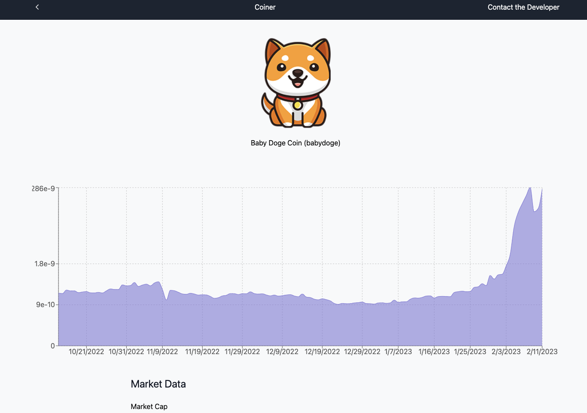
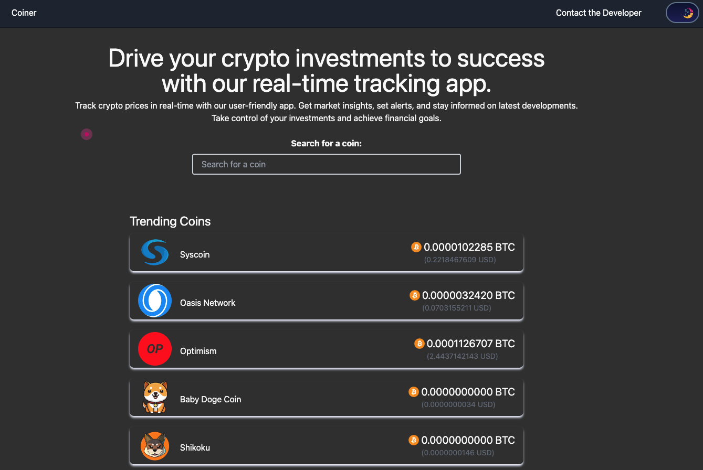
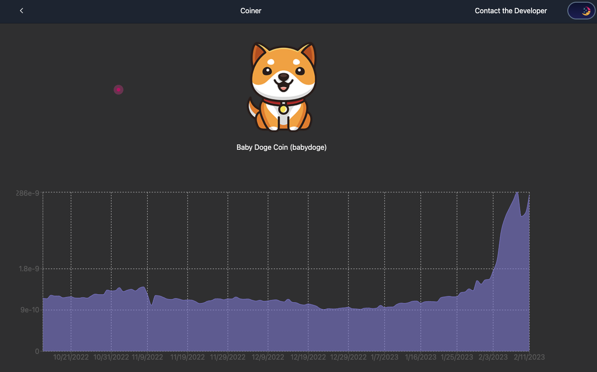

# The Crypto price tracking app 🔥💰

# This is a Crypto price tracking app that was built using [Coingecko Api](https://www.coingecko.com/en/api) and is a PWA web app. It show latest price all the cryptocurrencies. 🔥 🔥

### For clone this repository in your pc pest below link in your terminal 👇

```
git clone https://github.com/Milan-960/cryptocurrency-list.git
```

```
npm install
```

```
npm start
```

<h1>Home Page</h1>

<p>&nbsp;</p>

<h1>Info Page</h1>

<p>&nbsp;</p>

## Dark Mode 😎

<h1>Home Page</h1>

<p>&nbsp;</p>

<h1>Info Page</h1>

<p>&nbsp;</p>

## Author 😎

- **[Milan Sachani](https://github.com/milan-960)**
